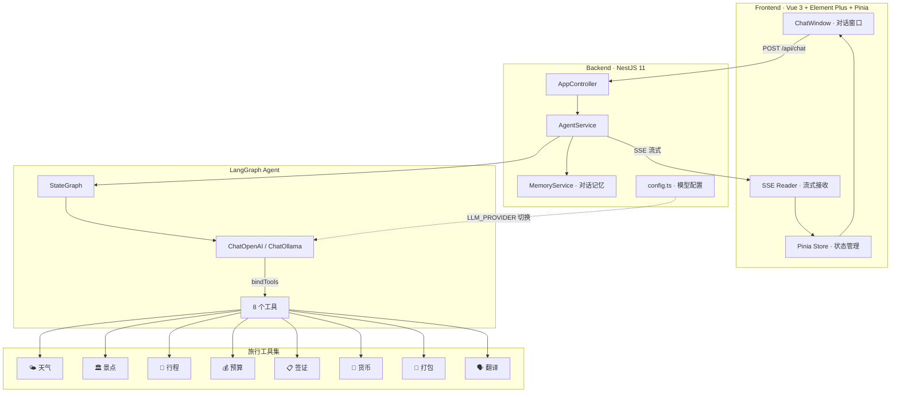

# ✈️ 旅途 · AI 旅行规划助手

[](https://nestjs.com/)
[](https://langchain-ai.github.io/langgraphjs/)
[](https://vuejs.org/)
[](https://www.typescriptlang.org/)
[](https://platform.deepseek.com/)
[](https://ollama.com/)

> 基于 NestJS 11 + LangGraph + Vue 3 的 AI 旅行规划助手，8 个专业工具协同工作，支持 Ollama 本地模型和 DeepSeek 云端模型一键切换。

## 架构总览



## LangGraph Agent 工作流

```
用户输入旅行需求（如"帮我规划3天北京行程"）
    ↓
Controller 接收请求 → AgentService.streamChat()
    ↓
构建 StateGraph：START → agent → tools → agent → ... → END
    ↓
Agent 节点：LLM 分析需要哪些工具
    ↓  (tool_calls: [{ name: "get_attractions", args: { city: "北京" } }])
Tools 节点：执行景点查询
    ↓
Agent 节点：LLM 分析结果，可能需要更多工具
    ↓  (tool_calls: [{ name: "plan_itinerary", args: { days: 3, ... } }])
Tools 节点：生成行程
    ↓
Agent 节点：信息足够，生成最终回答
    ↓
SSE 流式返回：data: { type: "text", content: "..." }
```

### 关键实现细节

- **LangGraph StateGraph**：`Annotation.Root` 定义 state（messages + itinerary），agent 节点 bindTools 调用 LLM，tools 节点执行具体工具
- **SSE 流式输出**：`async *streamChat()` 生成器函数，前端通过 `ReadableStream` reader 解析 `data:` 行
- **对话记忆**：`Map<string, BaseMessage[]>` 内存存储，每个会话保留最近 20 条消息，通过 `sessionId` 隔离
- **模型切换**：`backend/.env` 改一行 `LLM_PROVIDER` 即可在 Ollama 和 DeepSeek 间切换，其余代码零改动

## 8 个旅行工具

所有工具使用 `@langchain/core/tools` 的 `tool()` 函数定义，Zod Schema 校验参数：

| 工具 | 说明 | 数据策略 |
|------|------|----------|
| 🌤️ 天气查询 | 目的地实时天气 + 穿衣建议 | API 优先，降级模拟 |
| 🏛️ 景点推荐 | 12+ 城市景点数据 | 内置数据库 |
| 📅 行程规划 | 逐日详细行程（AI 生成） | rules + AI 混合 |
| 💰 预算估算 | 住宿/餐饮/交通/门票分项 | 城市基准价 + AI 调整 |
| 📋 签证查询 | 12+ 目的地签证信息 | 内置规则库 |
| 💱 货币换算 | 20+ 货币实时汇率 | 固定汇率基准 + 消费参考 |
| 🎒 打包清单 | 按季节 + 目的地 + 活动定制 | 规则 + AI 个性化 |
| 🗣️ 旅行翻译 | 常用旅行短语 + 发音指导 | 内置短语库 + AI 翻译 |

采用 **"规则 + AI 混合"** 策略：确定性数据（签证要求、货币汇率）走内置规则，模糊需求（行程安排、打包建议）走 AI 生成。这样既保证准确性，又有灵活性。

## 技术栈

| 层级 | 选型 | 说明 |
|------|------|------|
| 后端框架 | NestJS 11 | 企业级 Node.js 框架，DI + Module 模式 |
| AI 框架 | LangChain.js + LangGraph | Agent 编排 + 工具调用 |
| 聊天模型 | DeepSeek / Ollama | 双模式，一键切换 |
| 流式输出 | SSE | 单向服务器推送，比 WebSocket 更简单 |
| 前端框架 | Vue 3 Composition API | script setup 语法糖 |
| 状态管理 | Pinia | Vue 官方推荐，类型友好 |
| UI 组件 | Element Plus | 企业级 Vue 3 组件库 |
| 语言 | TypeScript | 全栈类型安全 |

## 项目结构

```
travel-agent/
├── backend/
│   └── src/
│       ├── main.ts                # NestJS 启动入口
│       ├── app.module.ts          # 模块注册
│       ├── app.controller.ts      # API 路由（/api/chat）
│       ├── config.ts              # 模型配置（Ollama / DeepSeek 切换）
│       ├── agent/
│       │   └── agent.service.ts   # LangGraph Agent（StateGraph + streamChat）
│       ├── tools/                 # 8 个旅行工具
│       │   ├── weather.tool.ts
│       │   ├── attractions.tool.ts
│       │   ├── itinerary.tool.ts
│       │   ├── budget.tool.ts
│       │   ├── visa.tool.ts
│       │   ├── currency.tool.ts
│       │   ├── packing.tool.ts
│       │   └── translator.tool.ts
│       ├── memory/
│       │   └── memory.service.ts  # 对话记忆（Map 存储，最多 20 条）
│       └── .env.example           # 环境变量模板
│
└── frontend/
    └── src/
        ├── main.js                # Vue 应用入口
        ├── router/                # Vue Router 路由
        ├── api/travel.js          # SSE 流式 API 封装
        ├── stores/chat.js         # Pinia 对话状态（appendToLastAssistant）
        ├── components/
        │   └── ChatWindow.vue     # 主聊天窗口（sendMessage + SSE onChunk）
        └── views/                 # 页面视图
```

## 快速开始

### 1. 配置大模型（二选一）

**方式一：Ollama 本地（免费，数据不出境）**
```bash
ollama pull qwen3.5:0.8b
# 默认已配置 Ollama，无需改动
```

**方式二：DeepSeek API**
```bash
# 编辑 backend/.env，注释 Ollama 三行，取消注释 DeepSeek 三行
LLM_PROVIDER=deepseek
DEEPSEEK_API_KEY=sk-你的密钥
DEEPSEEK_MODEL=deepseek-chat
```

### 2. 启动

```bash
cd backend && npm install && npm run start:dev   # → localhost:3000
cd frontend && npm install && npm run dev         # → localhost:5173
```

### 3. 使用

打开 `http://localhost:5173`，输入旅行需求即可（如"帮我规划一个3天的杭州行程"）。

## 面试要点

本项目展示的核心能力：

1. **LangGraph Agent 编排**：StateGraph 节点和边的设计，agent ↔ tools 循环的停止条件
2. **工具定义模式**：`tool()` + Zod Schema + description 提示工程，8 个工具统一风格
3. **流式输出**：`async *streamChat()` Generator + SSE，前端 ReadableStream 逐块解析
4. **依赖注入**：NestJS DI 模式，`@Injectable()` + Module 组织
5. **多模型切换**：通过配置驱动 `ChatOllama` vs `ChatOpenAI` 互斥创建，业务代码不变
6. **对话记忆**：`sessionId` 隔离 + Map 存储 + 数量上限（20 条），生产可换 Redis
7. **规则+AI 混合策略**：确定性数据走内置规则，模糊需求走 AI 生成
